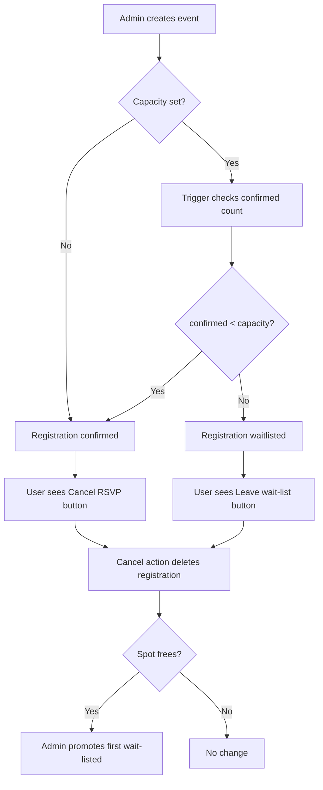

# Events Registration Flow

```mermaid
graph TD;
  A["Admin creates event"] --> B{"Capacity set?"};
  B -- "Yes" --> C["Trigger checks confirmed count"];
  B -- "No" --> F["Registration confirmed"];
  C --> D{"confirmed < capacity?"};
  D -- "Yes" --> F;
  D -- "No" --> E["Registration waitlisted"];
  F --> G["User sees Cancel RSVP button"];
  E --> H["User sees Leave wait-list button"];
  G --> I["Cancel action deletes registration"];
  H --> I;
  I --> J{"Spot frees?"};
  J -- "Yes" --> K["Admin promotes first wait-listed"];
  J -- "No" --> L["No change"];
``` 